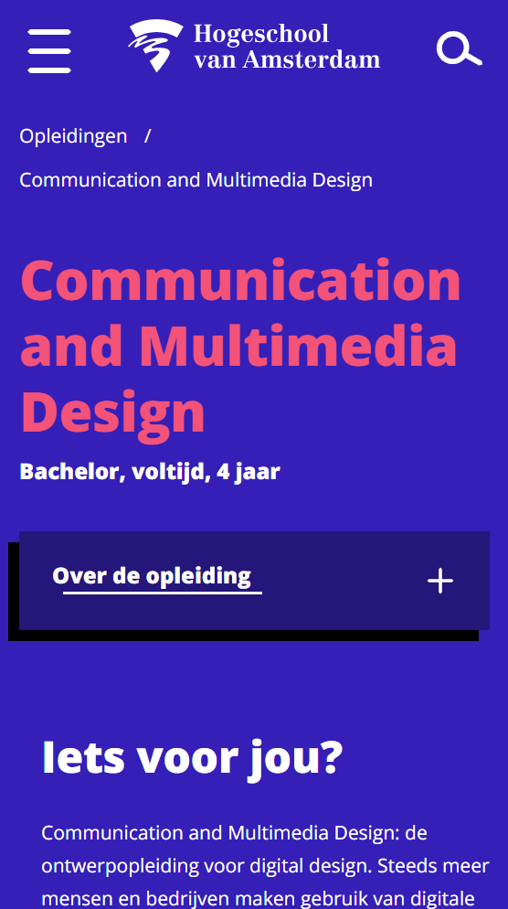
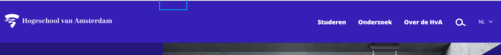
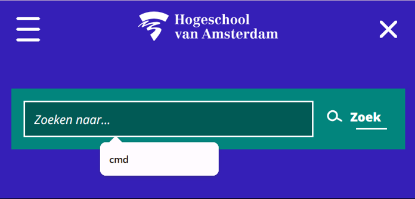
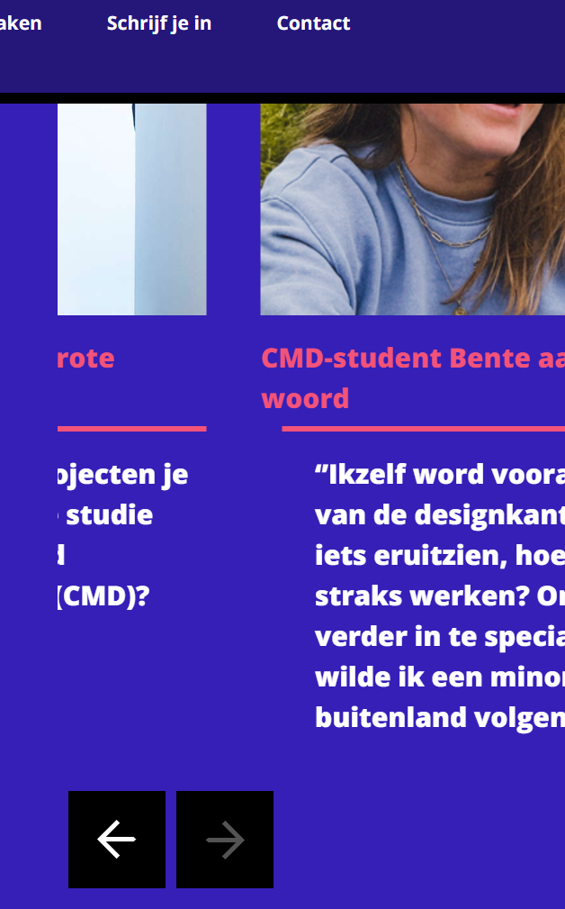
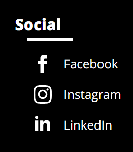
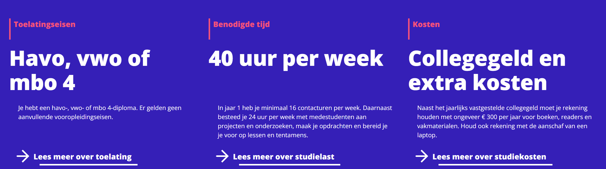
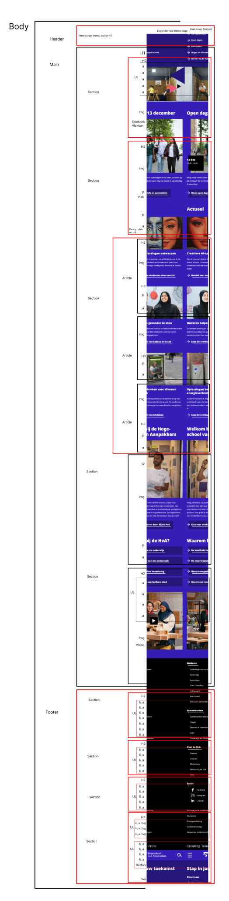
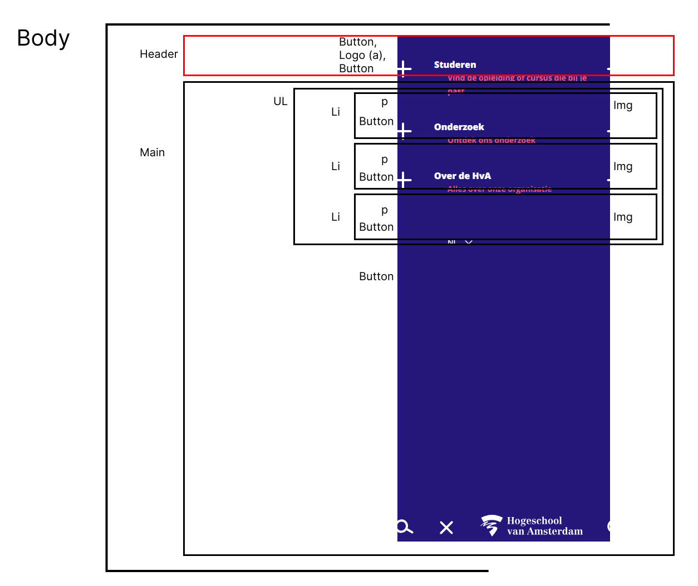
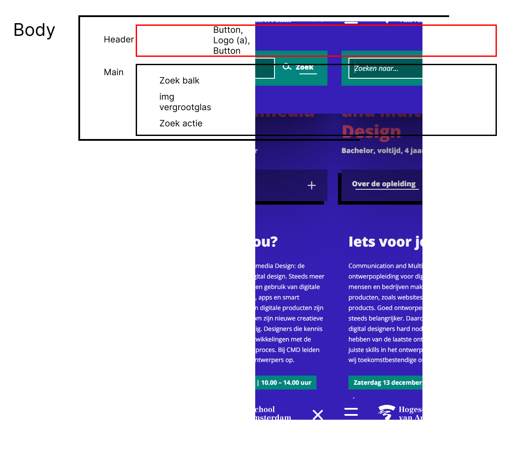

# Procesverslag

Markdown is een simpele manier om HTML te schrijven.  
Markdown cheat cheet: [Hulp bij het schrijven van Markdown](https://github.com/adam-p/markdown-here/wiki/Markdown-Cheatsheet).

Nb. De standaardstructuur en de spartaanse opmaak van de README.md zijn helemaal prima. Het gaat om de inhoud van je procesverslag. Besteedt de tijd voor pracht en praal aan je website.

Nb. Door _open_ toe te voegen aan een _details_ element kun je deze standaard open zetten. Fijn om dat steeds voor de relevante stuk(ken) te doen.

## Jij

  
uitwerken voor kick-off werkgroep

### Auteur:

Jada Sedoc

#### Je startniveau:

Blauw

#### Je focus:

Surface plane

## Je website

  
uitwerken voor kick-off werkgroep

### Je opdracht:

https://www.hva.nl/
link naar de website die je gaat namaken óf de naam/omschrijving van je eigen ontwerp

#### Screenshot(s) van de eerste pagina (small screen):

De HvA Home pagina

#### Screenshot(s) van de tweede pagina (small screen):

De HvA CMD pagina  
 

## Toegankelijkheidstest 1/2 (week 1)

  
uitwerken na test in 2e werkgroep

### Bevindingen

Lijst met je bevindingen die in de test naar voren kwamen:

1. De screenreader zegt undefined, er is dus een label die leeg is of ontbreekt.
   

2. De zoekfunctie heeft visueel een pop-up, voor als je vaker iets zoekt, dan komt dat woord terug als een pop-up, maar de screen-reader leest dat niet.
   

3. De zoekknop wordt vermeld als uitgeschakeld, maar je ziet niet waar of wat het is, aangezien je gewoon kan zoeken (kan iemand tot verwarring brengen).
4. Bij de carousel staan er pijlen om er door heen te navigeren, als je helemaal tot het einde gaat klikken en verder wilt gaan met de TAB functie, dan spring je terug naar het begin van de pagina, het zelfde gebeurt als je terug wilt klikken met de knoppen.
   

<!-- 5 en 6 en 7 moeten nog beter worden onderzocht -->

5. In de footer staat alles als een H2, behalve het Social kopje, dat is een H3
   

6. Instagram heeft geen alt tekst, maar Facebook en LinkedIn hebben dat wel. (De screenreader)
   

7. De carousel wordt het eerste list item volledig vertelt, maar de rest niet echt, alleen de kopjes
   
8. Iets dat mij opviel is dat op de CMD pagina zijn de H2 kleiner dan de H3, maar specifiek gedeelte
   

## Breakdownschets (week 1)

  
uitwerken na afloop 3e werkgroep

### de hele pagina:

  
  

### dynamisch deel (bijv menu):

  

### wellicht nog een dynamisch deel (bijv filter):

  

## Voortgang 1 (week 2)

  
uitwerken voor 1e voortgang

### Stand van zaken

hier dit ging goed & dit was lastig (neem ook screenshots op van delen van je website en code)

### Agenda voor meeting

samen met je groepje opstellen

| student 1      | student 2          | student 3    | student 4        |
| -------------- | ------------------ | ------------ | ---------------- |
| dit bespreken  | en dit             | en ik dit    | en dan ik dat    |
| en dat ook nog | dit als er tijd is | nog een punt | dit wil ik zeker |
| ...            | ...                | ...          | ...              |

Jada

1. Hoe haal ik de tekst meer naar links?
2. Er staat een svg voor de pijl, maar ik kan het niet vinden, is er een andere maneir?
3. Hoe pas ik de order aan H2 actueel en H3's?

Daniël

1. Hoe kan ik makkelijk meerdere hamburger menu’s gebruiken
2. ⁠Font face lijkt niet te werken bij mij
3. ⁠Hoe kan ik mijn video in het aan de zijkanten laten wegvagen

Annabel

1. Waarom doet mijn hamburger menu het de ene keer wel en de andere keer niet?
2. ⁠hoe zorg ik ervoor dat de navigatie op de index mee schaalt als het scherm groter wordt?
3. ⁠hoe zorg ik voor witruimte rond de tekst?
4. ⁠hoe zet ik de h1 en de p die daarbij hoort in het midden als het niet in een container zit?

Sid

1. Hoe verwerk ik advertenties in mn pagina.
2. ⁠hoe maak ik zo'n achtergrond zoals op de echte site
3. ⁠hoe maak ik een zoekbalk

### Verslag van meeting

hier na afloop snel de uitkomsten van de meeting vastleggen

- Ik moet mijn alt teksten beter gaan schrijven, nu staat er nog te weinig
- De tijd kan ik met <time> aanspreken
- Voor iconen moet ik svg's gebruiken vanuit svgrepo
- ...

## Voortgang 2 (week 3)

  
uitwerken voor 2e voortgang

### Stand van zaken

hier dit ging goed & dit was lastig (neem ook screenshots op van delen van je website en code)

### Agenda voor meeting

samen met je groepje opstellen

| student 1      | student 2          | student 3    | student 4        |
| -------------- | ------------------ | ------------ | ---------------- |
| dit bespreken  | en dit             | en ik dit    | en dan ik dat    |
| en dat ook nog | dit als er tijd is | nog een punt | dit wil ik zeker |
| ...            | ...                | ...          | ...              |

Jada

1. Hoe krijg ik de svg en link naast elkaar?
2. Hoe krijg ik een zwart vierkant achter mijn time
3. Hoe krijg ik mijn H1 samen met de nav (dat de background een geheel is)?

Daniël

Annabel

Sid

### Verslag van meeting

hier na afloop snel de uitkomsten van de meeting vastleggen

- punt 1
- punt 2
- nog een punt
- ...

## Toegankelijkheidstest 2/2 (week 4)

  
uitwerken na test in 9e werkgroep

### Bevindingen

Lijst met je bevindingen die in de test naar voren kwamen (geef ook aan wat er verbeterd is):

## Voortgang 3 (week 4)

  
uitwerken voor 3e voortgang

### Stand van zaken

hier dit ging goed & dit was lastig (neem ook screenshots op van delen van je website en code)

### Agenda voor meeting

samen met je groepje opstellen

| student 1      | student 2          | student 3    | student 4        |
| -------------- | ------------------ | ------------ | ---------------- |
| dit bespreken  | en dit             | en ik dit    | en dan ik dat    |
| en dat ook nog | dit als er tijd is | nog een punt | dit wil ik zeker |
| ...            | ...                | ...          | ...              |

### Verslag van meeting

hier na afloop snel de uitkomsten van de meeting vastleggen

- punt 1
- punt 2
- nog een punt
- ...

## Eindgesprek (week 5)

  
uitwerken voor eindgesprek

### Je uitkomst - karakteristiek screenshots:

  

### Dit ging goed/Heb ik geleerd:

Korte omschrijving met plaatjes

  

### Dit was lastig/Is niet gelukt:

Korte omschrijving met plaatjes

  

## Bronnenlijst

  
continu bijhouden terwijl je werkt

Nb. Wees specifiek ('css-tricks' als bron is bijv. niet specifiek genoeg).
Nb. ChatGpT en andere AI horen er ook bij.
Nb. Vermeld de bronnen ook in je code.

1. bron 1
2. bron 2
3. ...

