# Procesverslag

Markdown is een simpele manier om HTML te schrijven.  
Markdown cheat cheet: [Hulp bij het schrijven van Markdown](https://github.com/adam-p/markdown-here/wiki/Markdown-Cheatsheet).

Nb. De standaardstructuur en de spartaanse opmaak van de README.md zijn helemaal prima. Het gaat om de inhoud van je procesverslag. Besteedt de tijd voor pracht en praal aan je website.

Nb. Door _open_ toe te voegen aan een _details_ element kun je deze standaard open zetten. Fijn om dat steeds voor de relevante stuk(ken) te doen.

## Jij

  
uitwerken voor kick-off werkgroep

### Auteur:

Jada Sedoc

#### Je startniveau:

Blauw

#### Je focus:

Surface plane:
1. prefers-reduced-motion
2. Animaties: hover, micro-interactie
3. SVG stylen en animeren
4. Custom properties (meer dan alleen kleur)
5. Micro interacties 
6. States van controls (hover, focused etc.)

EXTRA
7. Ik heb 1x has() gebruikt, maar wel met hulp, maar zelf bedacht dat ik het kon gebruiken

## Je website

  
uitwerken voor kick-off werkgroep

### Je opdracht:

https://www.hva.nl/
link naar de website die je gaat namaken óf de naam/omschrijving van je eigen ontwerp

#### Screenshot(s) van de eerste pagina (small screen):

De HvA Home pagina

#### Screenshot(s) van de tweede pagina (small screen):

De HvA CMD pagina  
 

## Toegankelijkheidstest 1/2 (week 1)

  
uitwerken na test in 2e werkgroep

### Bevindingen

Lijst met je bevindingen die in de test naar voren kwamen:

1. De screenreader zegt undefined, er is dus een label die leeg is of ontbreekt.
   

2. De zoekfunctie heeft visueel een pop-up, voor als je vaker iets zoekt, dan komt dat woord terug als een pop-up, maar de screen-reader leest dat niet.
   

3. De zoekknop wordt vermeld als uitgeschakeld, maar je ziet niet waar of wat het is, aangezien je gewoon kan zoeken (kan iemand tot verwarring brengen).
4. Bij de carousel staan er pijlen om er door heen te navigeren, als je helemaal tot het einde gaat klikken en verder wilt gaan met de TAB functie, dan spring je terug naar het begin van de pagina, het zelfde gebeurt als je terug wilt klikken met de knoppen.
   

5. In de footer staat alles als een H2, behalve het Social kopje, dat is een H3
   

6. Instagram heeft geen alt tekst, maar Facebook en LinkedIn hebben dat wel. (De screenreader)
   

7. De carousel wordt het eerste list item volledig vertelt, maar de rest niet echt, alleen de kopjes
   
8. Iets dat mij opviel is dat op de CMD pagina zijn de H2 kleiner dan de H3, maar specifiek gedeelte
   

WCAG checklist wat niet goed is HvA:
1. Hun HTML heeft errors (meer errors dan op de afbeelding te zien is)
  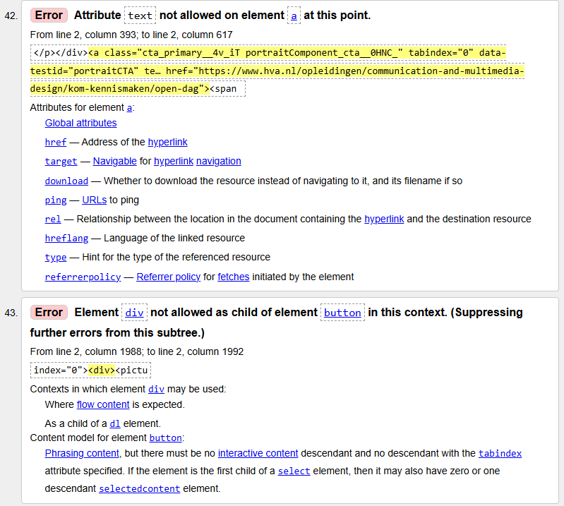 
  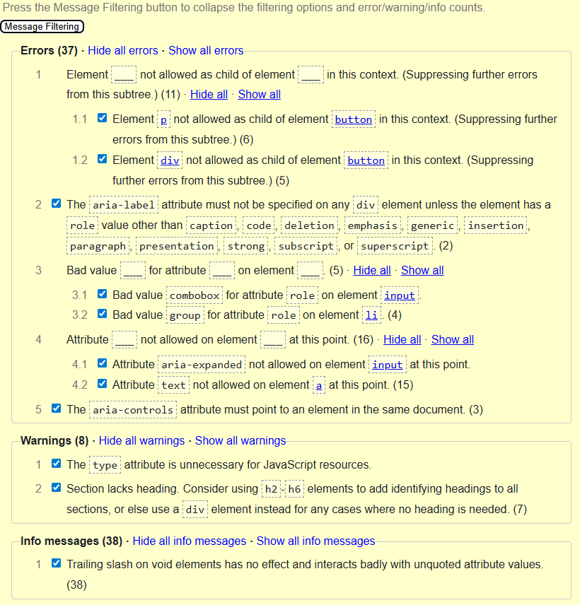 

2. Check to see that keyboard focus order matches the visual layout: Moet het plusje als eerst? Voor mij voelt dat gewoon niet heel goed, maar ik heb er ook niet heel veel ervaring in.
  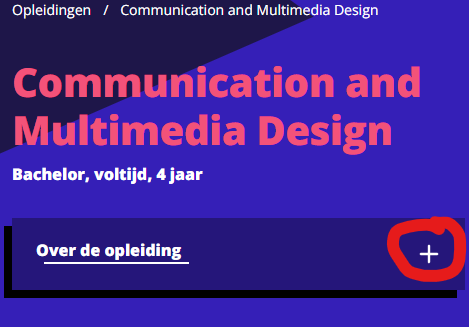 

3. YouTube video's spelen op een andere pagina af? geen idee wat het precies is, maar het is makkelijk te sluiten, maar ik schrijf het als nog even hier op.
  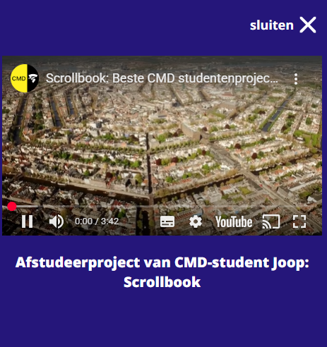 

4. Ze hebben geen Light/Dark mode, alleen 1 modus (zie alle vorige afbeeldingen van de website)

5. Voor high contrast mode had ik no, ben vergeten waarom, maar heb het niet kunnen vinden, dus ook geen voorbeeld dan, maar wel gewoon even opschrijven, zodat het genoteerd staat.

6. De roze contrast voor kleine letters op de CMD pagina is niet goed.
  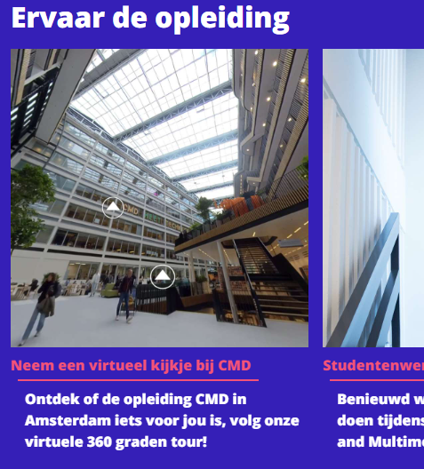 

## Breakdownschets (week 1)

  
uitwerken na afloop 3e werkgroep

### de hele pagina:

  
  

### dynamisch deel (bijv menu):

  

### wellicht nog een dynamisch deel (bijv filter):

  

## Voortgang 1 (week 2)

  
uitwerken voor 1e voortgang

### Stand van zaken

hier dit ging goed & dit was lastig (neem ook screenshots op van delen van je website en code)

### Agenda voor meeting

samen met je groepje opstellen

| student 1      | student 2          | student 3    | student 4        |
| -------------- | ------------------ | ------------ | ---------------- |
| dit bespreken  | en dit             | en ik dit    | en dan ik dat    |
| en dat ook nog | dit als er tijd is | nog een punt | dit wil ik zeker |
| ...            | ...                | ...          | ...              |

Jada

1. Hoe haal ik de tekst meer naar links?
2. Er staat een svg voor de pijl, maar ik kan het niet vinden, is er een andere maneir?
3. Hoe pas ik de order aan H2 actueel en H3's?

Daniël

1. Hoe kan ik makkelijk meerdere hamburger menu’s gebruiken
2. ⁠Font face lijkt niet te werken bij mij
3. ⁠Hoe kan ik mijn video in het aan de zijkanten laten wegvagen

Annabel

1. Waarom doet mijn hamburger menu het de ene keer wel en de andere keer niet?
2. ⁠hoe zorg ik ervoor dat de navigatie op de index mee schaalt als het scherm groter wordt?
3. ⁠hoe zorg ik voor witruimte rond de tekst?
4. ⁠hoe zet ik de h1 en de p die daarbij hoort in het midden als het niet in een container zit?

Sid

1. Hoe verwerk ik advertenties in mn pagina.
2. ⁠hoe maak ik zo'n achtergrond zoals op de echte site
3. ⁠hoe maak ik een zoekbalk

### Verslag van meeting

hier na afloop snel de uitkomsten van de meeting vastleggen

- Ik moet mijn alt teksten beter gaan schrijven, nu staat er nog te weinig
- De tijd kan ik met <time> aanspreken
- Voor iconen moet ik svg's gebruiken vanuit svgrepo
- De order kan je gewoon met order aanpassen

## Voortgang 2 (week 3)

  
uitwerken voor 2e voortgang

### Stand van zaken
De time was nog niet goed 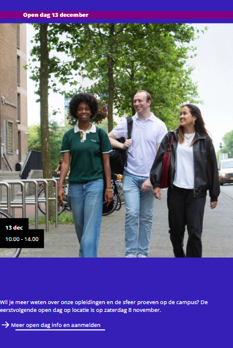
hier dit ging goed & dit was lastig (neem ook screenshots op van delen van je website en code)

### Agenda voor meeting

samen met je groepje opstellen

| student 1      | student 2          | student 3    | student 4        |
| -------------- | ------------------ | ------------ | ---------------- |
| dit bespreken  | en dit             | en ik dit    | en dan ik dat    |
| en dat ook nog | dit als er tijd is | nog een punt | dit wil ik zeker |
| ...            | ...                | ...          | ...              |

Jada

1. Hoe krijg ik de svg en link naast elkaar?
2. Hoe krijg ik een zwart vierkant achter mijn time
3. Hoe krijg ik mijn H1 samen met de nav (dat de background een geheel is)?

Daniël

Annabel

1. Hoe krijg ik die h2 in het midden van de pagina, positioneren lijkt niet te helpen
2. ⁠hoe krijg ik de video en h2 in het midden.
3. ⁠is het genoeg?
4. ⁠moet het logo een svg zijn

Sid

1. Is er echt geen betere en overzichtelijkere manier om css te stylen?
2. Zijn er dingen die ik op dit punt beter kan herstructureren voordat ik verder ga?
3. Is het verstandig om eerst de volledige dektop-versie af te maken voordat ik overstap naar responsive?

### Verslag van meeting

hier na afloop snel de uitkomsten van de meeting vastleggen

- Svg gewoon in de a plaatsen
- Het vriekant maak je met grid, daarvan heb ik een voorbeeld gekregen
- De H1 kon ik plaatsen in de section
- ...

## Toegankelijkheidstest 2/2 (week 4)

  
uitwerken na test in 9e werkgroep

### Bevindingen

Lijst met je bevindingen die in de test naar voren kwamen (geef ook aan wat er verbeterd is):
Sommigen dingen waren niet van toepassing, omdat ik die niet heb gemaakt, zoals video's, dus daar ga ik het niet over hebben.
1. Ik heb uitgebreidere img teksten geschreven
2. Ook een skip to main link, maar daar ook meer uitleg bij geplaatst
3. Het logo img heeft ook een iets bredere beschrijving
4. De zoekbalk heeft een bredere beschrijving

WCAG Checklist
1. HTML is validated en geen errors 

2. Does the site only allow portrait orientation?. Mehh op computer is het niet echt mooi.

3. Ik gebruik buttons elements voor buttons

4. Dark en light mode is supported bij mij

5. Prefers-reduced-motion available

6. Ik heb mijn contrast gecontroleerd en was goed

## Voortgang 3 (week 4)

  
uitwerken voor 3e voortgang

### Stand van zaken
Mijn carousel liet de tekst buiten beeld gaan, en je kon niet scrollen er op.

Maar voor de rest, ik heb best snel de pagina kunnen maken en schrijven, dus ben er tevreden mee.
hier dit ging goed & dit was lastig (neem ook screenshots op van delen van je website en code)
na de lessen had ik een geval dat mijn tekst in beeld kwam van de header, maar is nu wel opgelost
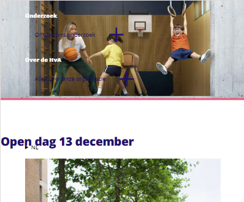

### Agenda voor meeting

samen met je groepje opstellen

| student 1      | student 2          | student 3    | student 4        |
| -------------- | ------------------ | ------------ | ---------------- |
| dit bespreken  | en dit             | en ik dit    | en dan ik dat    |
| en dat ook nog | dit als er tijd is | nog een punt | dit wil ik zeker |
| ...            | ...                | ...          | ...              |

Jada

1. Hoe zorg ik dat de tekst niet uit mijn kader gaat
2. Hoe kan ik er voor zorgen als je op de carousel komt je nog verder omlaag kan scrollen
3. Hie krijg ik de pijlen in de buttons van mijn carrousel een andere kleur

## Daniël

Annabel

1. Hoe laatste TD selecteren van tabel

## Sid

### Verslag van meeting

hier na afloop snel de uitkomsten van de meeting vastleggen

- Lijstje read.me van surface plane opties
- De carousel max-widt geven, zodat de rest van de pagina binnen de border blijft
- De carousel moetst scroll-snap-type: x mandatory; krijgen, zodat je er overheen kan scrollen en niet vast loopt op de pagina
- De svg in de button en fill weg en de fill in de css stylen zelf
- Haal alle styling in svg fill weg, geen styling daar.
- ...

## Eindgesprek (week 5)

  
uitwerken voor eindgesprek

### Je uitkomst - karakteristiek screenshots:

  

### Dit ging goed/Heb ik geleerd:

Ik heb geleerd hoe ik een menu uit laat klappen, het was een gedoe, maar uiteindelijk is het mij gelukt.

  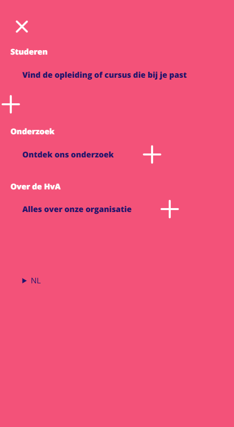

Ook heb ik geleerd hoe ik met nth-type-of-child moet werken.

  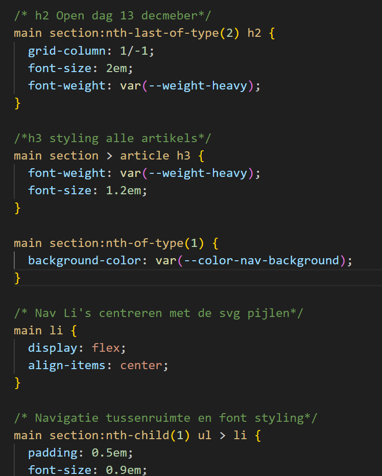

Ook heb ik geleerd dat je een p of svg in een a element kan doen, en dat een h1 in een sectie kan staan

  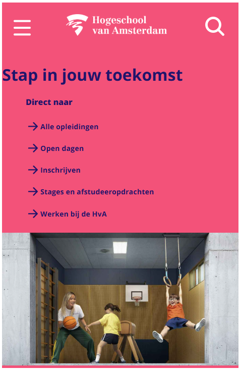

  Ook heb ik geleerd animaties maken en vele andere dingen tijdens de les, zoals root, keyframes, etc. Ik kan mij nu niet alles herrineren, maar wel veel nieuwe dingen geleerd, of ik het nou heb toegepast of niet.

Voor de focus kan je blijkbaar niet op een svg zetten, dus eerst werkte de img focus niet, ik had het met rust gelaten, maar na ChaGPT gevraagd waarom het niet werkte vertelde hij dat het niet kan op svg en liet een voorbeeld zien. Dit was voor mijn vergrootglas, dus ik heb het toegepast ook op de img en het werkte daar ook.

### Dit was lastig/Is niet gelukt:

De carousel heb ik niet perfect gemaakt, zo zijn er nog kleine dingen die niet goed zijn, zoals wanneer je het opschaalt het er niet best uit ziet. De tekst is niet met elkaar allemaal gelijk.

  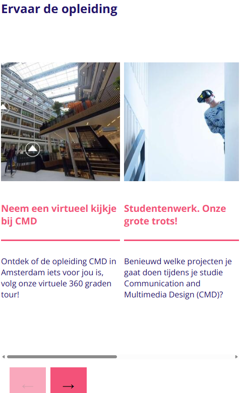

De plus heb ik niet uitgewerkt, dat had ik graag nog willen doen.

  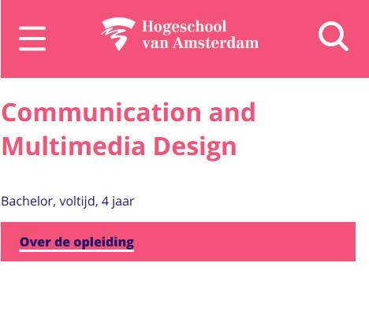

De tijd blok was verandert, nadat ik de error had opgelost. Ik moest 2 tijdblokken maken, waardoor de tekst werd verpest.

  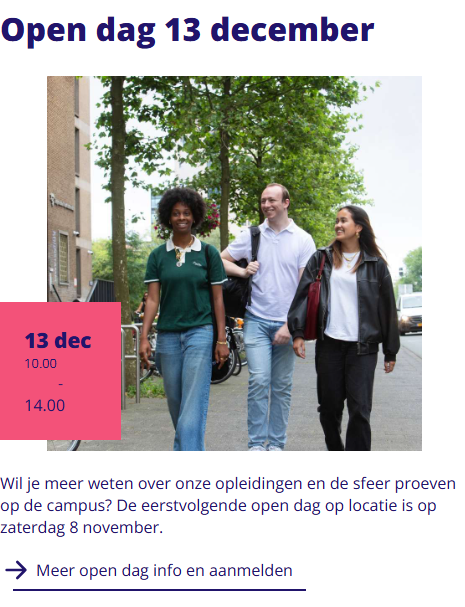

  

## Bronnenlijst

  
continu bijhouden terwijl je werkt

Nb. Wees specifiek ('css-tricks' als bron is bijv. niet specifiek genoeg).
Nb. ChatGpT en andere AI horen er ook bij.
Nb. Vermeld de bronnen ook in je code.

1. ChatGPT:
- https://css-tricks.com/snippets/css/a-guide-to-flexbox/ Chatgpt heeft uitgelegd wat ik nodig had om mijn menu te centreren en de website heeft het verder uitgelegd
- Code laten uitleggen wat het doet en errors laten bekijken uitleggen (Header menu, Niet gelukt en heb het gevraagd aan een klas genoot : Roos Buskermolen)
- has(): PROMPT: Oh sorry ik wil dat de p die nu onder aan de pagina staat, wil ik direct onder de h1 hebben. Dus hoe spreek ik de p direct onder de h1 aan? ANTWOORD: 
/* De p direct onder h1 moet bovenaan */
main h1:has(+ p) + p {
  order: 0;
}

- PROMPT: Waarom werkt dit niet? header > a > svg:focus{ background-color: var(--focus-header-state); }, want zonder svg werkt het wel. ANTWOORD: Je moet de focus op de <a> zetten, niet op de <svg>. 
header > a:focus svg {
  background-color: var(--focus-header-state);
}

2. HTML:
- BRONVERMELDING, skip to main https://www.a11y-collective.com/blog/skip-to-main-content/ (uitleggen hoe je de skip to main link kan maken en waar ik wat moet plaatsen)

3. CSS:
- BRONVERMELDING: https://johandejong.dev/blog/sticky-header-with-show-hide-on-scroll (Hoe de header sticky show hide kan maken)
- BRONVERMELDING: skip to main https://www.a11y-collective.com/blog/skip-to-main-content/ En Roos Buskermolen: body > a code uitgeleg, zodat het wel werkt, ik had de vekeerde naam gegeven
- BRONVERMELDING: Roos Buskermolen (nav (translate) en nav.geopend) Ze heeft geholpen met js code de nav schrijven en in html de regels toevoegen van translate, zodat het werkte en open ging (menu)
- BRONVERMELDING: https://css-tricks.com/snippets/css/a-guide-to-flexbox/ Vermeld flex of inline flex.  en bij align-self kan alleen vertical-align op non flex-items
- BRONVERMELDING: https://johandejong.dev/blog/sticky-header-with-show-hide-on-scroll Weer de sticky header met hulp van Sanne 't Hooft om het te laten werken

- BRONVERMELDING: Carousel: https://codepen.io/shooft/pen/QwjQGZe?editors=1100* hoe de carousel gemaakt moet worden
- BRONVERMELDING: Carousel: https://codepen.io/shooft/pen/QwjQGZe Hoe de buttons moeten worden gemaakt

4. JS:
- BRONVERMELDING Roos Buskermolen: deNav (geholpen wat ik moest plaatsen in js)
- BRONVERMELDING sticky header: https://johandejong.dev/blog/sticky-header-with-show-hide-on-scroll + Sanne 't Hooft (Hoe de header weg gaat als je omlaag scrolt en terug wanneer je omhoog scrolt)

